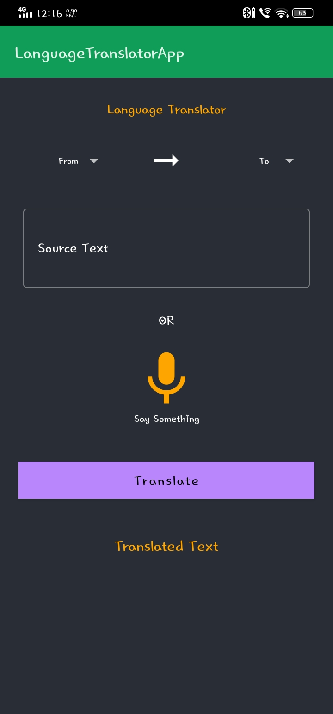
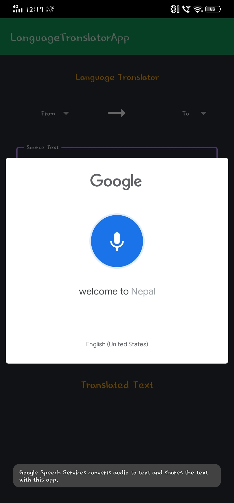
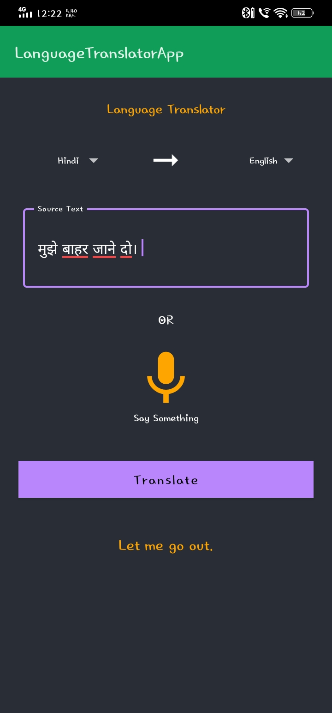
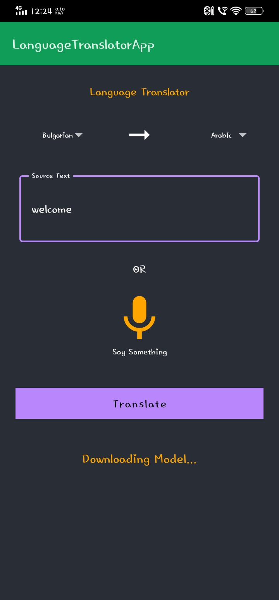

# Language-Translator-App
This is a language translator app where we can translate any language. For that we have to give the text to translate, we can also give the text through voice.
## Backend Database
I used firebase as Backend Database.
## Screenshots
<table>
<tr>
<td></td>
  <td></td>
</tr>
  

 <tr>
   <td></td>
  <td></td>
  </tr>
</table>
